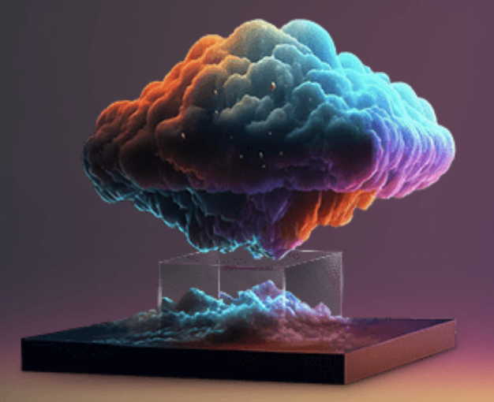

[![Contributors][contributors-shield]][contributors-url]
[![Forks][forks-shield]][forks-url]
[![Stargazers][stars-shield]][stars-url]
[![Issues][issues-shield]][issues-url]
<!-- [![LinkedIn][linkedin-shield]][linkedin-url] -->
<!-- [![MIT License][license-shield]][license-url] -->

<!-- PROJECT LOGO -->
 

  

<h3 align="center">Curvetopia - Gensolve Adobe 2024</h3>

  

    This project is a part of the Gensolve Adobe 2024 Hackathon. It takes in input the doodle of a shape and return the predicted shape.
     
    <a href="https://github.com/d-pamneja/CURVETOPIA_DA/issues">Report Bug</a>
    ·
    <a href="https://github.com/d-pamneja/CURVETOPIA_DA/issues">Request Feature</a>
  

<!-- TABLE OF CONTENTS -->

  
Table of Contents

  <ol>
    <li>
      <a href="#about-the-project">About The Project</a>
      <ul>
        <li><a href="#built-with">Built With</a></li>
      </ul>
    </li>
    <li><a href="#contributing">Contributing</a></li>
    <li><a href="#contact">Contact</a></li>
  </ol>

<!-- ABOUT THE PROJECT -->
## About The Project

[![Product Name Screen Shot][product-screenshot]](https://example.com)

The project focuses on the classification and regularization of 2D curves, particularly in the context of hand-drawn shapes and doodles. The primary goal is to develop algorithms that can accurately identify and categorize various geometric shapes within a given set of curves. The project emphasizes the ability to handle imperfect and irregular shapes, recognizing that hand-drawn doodles often deviate from ideal geometric forms. The classification process involves analyzing the geometric properties of the input curves and applying pattern recognition techniques to distinguish between different shape categories, such as lines, circles, ellipses, rectangles, polygons, and stars. The project's focus on shape classification and regularization contributes to the broader field of computer vision and image analysis, with potential applications in areas like digital art, design tools, and educational software.

(<a href="#readme-top">back to top</a>)

### Built With

* [![opencv][opencv]][opencv-url]
* [![scikit-learn][scikit-learn]][scikit-learn-url]
* [![numpy][numpy]][numpy-url]

(<a href="#readme-top">back to top</a>)

<!-- CONTRIBUTING -->
## Contributing

I'm thrilled to have you exploring my project! This endeavor is a collective effort, and we believe that every contribution adds value and creativity to our community.

How You Can Contribute:

🛠️ Found a bug? Have an idea for improvement? Fork the repo and create a pull request.

💡 Have a suggestion for making this project even better? Open an issue with the "enhancement" tag.

⭐ Like what you see? Show your support by giving our project a star!

Remember, your contributions, whether big or small, are incredibly valuable to us. They help us learn, inspire, and create a better project together.

1. Fork the Project
2. Create your Feature Branch (`git checkout -b feature/AmazingFeature`)
3. Commit your Changes (`git commit -m 'Add some AmazingFeature'`)
4. Push to the Branch (`git push origin feature/AmazingFeature`)
5. Open a Pull Request

Thank you for being a part of this journey!

(<a href="#readme-top">back to top</a>)

<!-- CONTACT -->
## Contact

Dhruv Pamneja - dpamneja@gmail.com / 21f1001719@ds.study.iitm.ac.in
 
Abhay Chaudary - https://github.com/Abhayindia

Project Link: [https://github.com/d-pamneja/CURVETOPIA_DA](https://github.com/d-pamneja/CURVETOPIA_DA)

(<a href="#readme-top">back to top</a>)

<!-- MARKDOWN LINKS & IMAGES -->
<!-- https://www.markdownguide.org/basic-syntax/#reference-style-links -->
[contributors-shield]: https://img.shields.io/github/contributors/d-pamneja/CURVETOPIA_DA.svg?style=for-the-badge
[contributors-url]: https://github.com/d-pamneja/CURVETOPIA_DA/graphs/contributors
[forks-shield]: https://img.shields.io/github/forks/d-pamneja/CURVETOPIA_DA.svg?style=for-the-badge
[forks-url]: https://github.com/d-pamneja/d-pamneja/CURVETOPIA_DA/network/members
[stars-shield]: https://img.shields.io/github/stars/d-pamneja/CURVETOPIA_DA.svg?style=for-the-badge
[stars-url]: https://github.com/d-pamneja/CURVETOPIA_DA/stargazers
[issues-shield]: https://img.shields.io/github/issues/d-pamneja/CURVETOPIA_DA.svg?style=for-the-badge
[issues-url]: https://github.com/d-pamneja/CURVETOPIA_DA/issues
[license-shield]: https://img.shields.io/github/license/d-pamneja/CURVETOPIA_DA.svg?style=for-the-badge
[license-url]: https://github.com/d-pamneja/CURVETOPIA_DA/blob/master/LICENSE.txt
[linkedin-shield]: https://img.shields.io/badge/-LinkedIn-black.svg?style=for-the-badge&logo=linkedin&colorB=555
[linkedin-url]: https://www.linkedin.com/in/dhruv-pamneja-3b8432187/
[product-screenshot]: static/homepage_ss.png
[amazonaws]: https://img.shields.io/badge/Amazon_AWS-FF9900?style=for-the-badge&logo=amazonaws&logoColor=white
[amazonaws-url]: https://aws.amazon.com/
[chromadb]: https://img.shields.io/badge/ChromaDB-000000?style=for-the-badge&logo=chromadb&logoColor=white
[chromadb-url]: https://www.trychroma.com
[flask]: https://img.shields.io/badge/Flask-000000?style=for-the-badge&logo=flask&logoColor=white
[flask-url]: https://flask.palletsprojects.com/en/2.0.x/
[Next.js]: https://img.shields.io/badge/next.js-000000?style=for-the-badge&logo=nextdotjs&logoColor=white
[Next-url]: https://nextjs.org/
[React.js]: https://img.shields.io/badge/React-20232A?style=for-the-badge&logo=react&logoColor=61DAFB
[React-url]: https://reactjs.org/
[Vue.js]: https://img.shields.io/badge/Vue.js-35495E?style=for-the-badge&logo=vuedotjs&logoColor=4FC08D
[Vue-url]: https://vuejs.org/
[Angular.io]: https://img.shields.io/badge/Angular-DD0031?style=for-the-badge&logo=angular&logoColor=white
[Angular-url]: https://angular.io/
[Svelte.dev]: https://img.shields.io/badge/Svelte-4A4A55?style=for-the-badge&logo=svelte&logoColor=FF3E00
[Svelte-url]: https://svelte.dev/
[Laravel.com]: https://img.shields.io/badge/Laravel-FF2D20?style=for-the-badge&logo=laravel&logoColor=white
[Laravel-url]: https://laravel.com
[Bootstrap.com]: https://img.shields.io/badge/Bootstrap-563D7C?style=for-the-badge&logo=bootstrap&logoColor=white
[Bootstrap-url]: https://getbootstrap.com
[JQuery.com]: https://img.shields.io/badge/jQuery-0769AD?style=for-the-badge&logo=jquery&logoColor=white
[JQuery-url]: https://jquery.com 
[Pandas]: https://img.shields.io/badge/pandas-%23150458.svg?style=for-the-badge&logo=pandas&logoColor=white
[Pandas-url]: https://pandas.pydata.org
[scikit-learn]: https://img.shields.io/badge/scikit--learn-%23F7931E.svg?style=for-the-badge&logo=scikit-learn&logoColor=white
[scikit-learn-url]: https://scikit-learn.org/stable/
[openai]: https://img.shields.io/badge/OpenAI-5A5A5A?style=for-the-badge&logo=openai&logoColor=white
[openai-url]: https://openai.com
[opencv]: https://img.shields.io/badge/OpenCV-5C3EE8?style=for-the-badge&logo=opencv&logoColor=white
[opencv-url]: https://opencv.org
[numpy]: https://img.shields.io/badge/NumPy-013243?style=for-the-badge&logo=numpy&logoColor=white
[numpy-url]: https://numpy.org
[langchain]: https://img.shields.io/badge/Langchain-FF2D20?style=for-the-badge&logo=langchain&logoColor=white
[langchain-url]: https://langchain.com